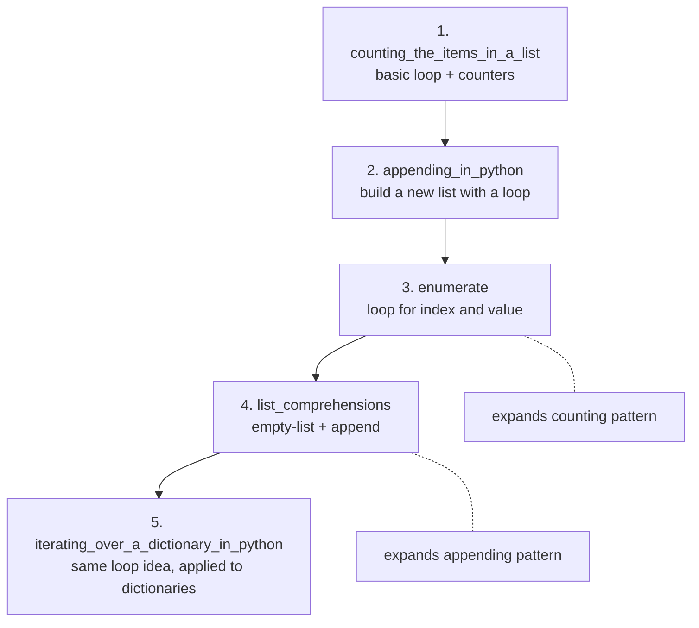

# Boot.dev Take-Home Lessons

This repo contains my two lessons for the boot.dev Course Author application. I've also included a methodology section to share more insights about my thought process. I thoroughly enjoyed creating these lessons and hope they are just as fun to read!

## Methodology

My very first thought for this task was to go through every lesson in the Python course and analyze the content structure, word count, and number of code snippets.

I quickly realized this would be a terrible idea and started to think of a different approach.

A comprehensive analysis of all 168 lessons in the Python course would yield plenty of information, but it wouldn't be very useful in this case. It would only show me the *average* presentation for the concepts in the course, many of which are not directly connected.

Instead of a brute force method, I needed to get granular. I wanted to see if I could find 2-3 lessons in the course that were closely related to the `enumerate` and `list_comprehension` concepts. That group would inform the bulk of my writing.

The three lessons I ended up choosing were:

1. `counting_the_items_in_a_list`
2. `appending_in_python`
3. `iterating_over_a_dictionary_in_python`

As you can imagine, this proved to be a much more accessible strategy.

## Lesson Progression



## Reasoning Behind the Order

1. **`counting_the_items_in_a_list`**

It made sense to start here as this is a pretty rudimentary loop pattern (`for i in range(0, len(...))`).

2. **`appending_in_python`**

This is the next logical step in my opinion. Instead of just reading a list, you learn to *build* one (`[]` + `.append()` in a loop).

3. **`enumerate`**

`enumerate` is a direct upgrade to the list iteration technique covered in the counting lesson. It starts off by showing the previous `for i in range(0, len(items))` style first, then replaces it.

4. **`list_comprehensions`**

Similar to `enumerate`, `list_comprehension` is an upgrade to the list building technique covered in the appending lesson. It starts off by showing the previous `[]` + `.append()` method first, then collapses it into one line.

5. **`iterating_over_a_dictionary_in_python`**

Here we are applying looping to a new data structure. The assignment in this lesson also combines looping with tracking a "max_so_far" variable to reinforce some earlier concepts.

## Final Thoughts

I personally think that between the two subjects covered in this take-home, it makes more sense to teach `enumerate` first. That said boot.dev's Python course introduces lists in chapter 9 and dictionaries in chapter 10, so they are both taught at roughly the same time.

The reason I bring this up is I wanted to make sure my solution to the `enumerate` assignment (or at least the preferred solution) did not rely on list comprehension. With that in mind, I've included an alternate, "preferred" solution to the `enumerate` assignment below.

```python
def numbered_inventory(items):
    return [f"{i}. {item}" for i, item in enumerate(items, start=1)]
```

It's also worth noting that both the above solution and the current `complete_main.py` in the `enumerate` directory will satisfy the testing suite. I have not included any directives to steer students towards specific solutions, but wanted to point it out as it's something I would be aware of were I to write additional lessons in the future.